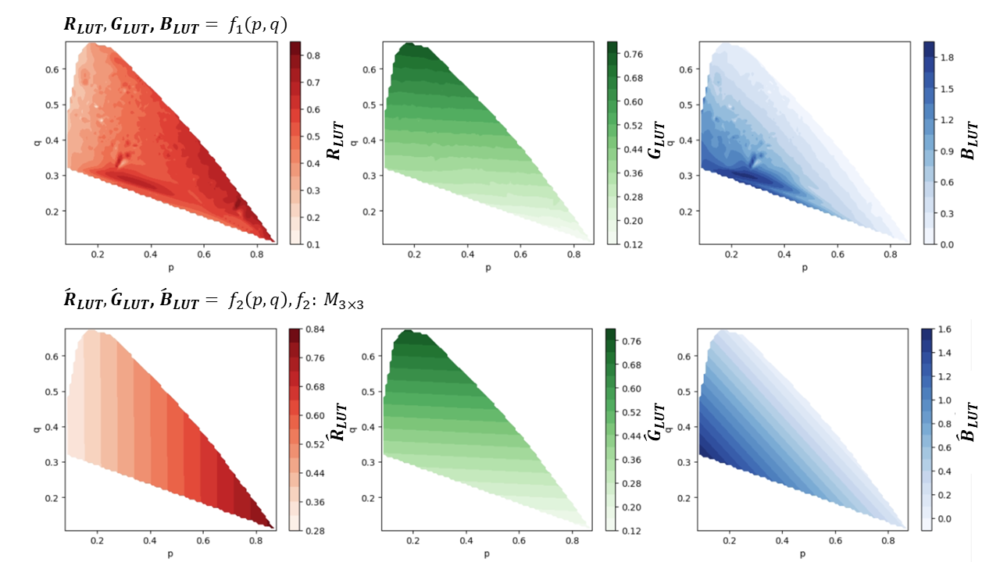

    <h1 align="center">Camera Color Correction Using Two-Dimensional Transform (rethink)</h1>

## Intorduction
Inpsired by Ref. [1], I try to check how much accuracy a linear 3 $\times$ 3 matrix can produce in color space conversion / color transformation. 

## The Dataset used
1. Spectral Reflectance Distributions (SRDs) come from [Colour Constancy Synthetic Test Data](https://www2.cs.sfu.ca/~colour/data/colour_constancy_synthetic_test_data/index.html)[2].
2. Camera Spectral Sensitivity (CSS) come from [Flying Drone Multi-Illuminant Test Set](https://www2.cs.sfu.ca/~colour/data2/DRONE-Dataset/)[3].

## Code
### Prerequisite
1. Python == 3.9.18 or higher (finished and tested on Python 3.9.18)
2. color-sciecne == 0.4.4
3. RUN `ColorTransformation2DLUT.ipynb`.

### Results
1. calculate naive RGB responses (in device-dependent space defined by CSS) at 3200K blackbody radiance (typicall indoor illuminant).
2. calculate ACES RGB responses (Academy Color Encoding Specification - Reference Image Capture Device) at CIE D65.
3. normalize 1. and 2. to the training input ($p$ abd $q$ based on Eq.(3)[1]) and output ($R_{LUT}$, $G_{LUT}$, and $B_{LUT}$ based on Eq.(4)[1]) of the proposed 2D-LUT method[1].
4. generate the visualization (i.e. Figure 6.[1]) to illustrate the residual from linear 3 $\times$ 3 matrix for color space conversion.

## Reference
[1] Jon S. McElvain, Walter Gish, "Camera Color Correction Using Two-Dimensional Transforms"  in Proc. IS&T 21st Color and Imaging Conf.,  2013,  pp 250 - 256. 
[2] Barnard, K., Martin, L., Funt, B. and Coath, A., A data set for color research. Color Res. Appl., 27, 2002 : 147-151. 
[3] Hoda Aghaei, Brian Funt, "A Flying Gray Ball Multi-illuminant Image Dataset for Color Research"  in Journal of Imaging Science and Technology,  2020,  pp 050411-1 - 050411-8.  
